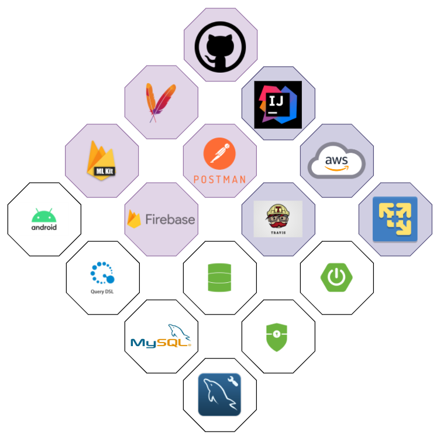
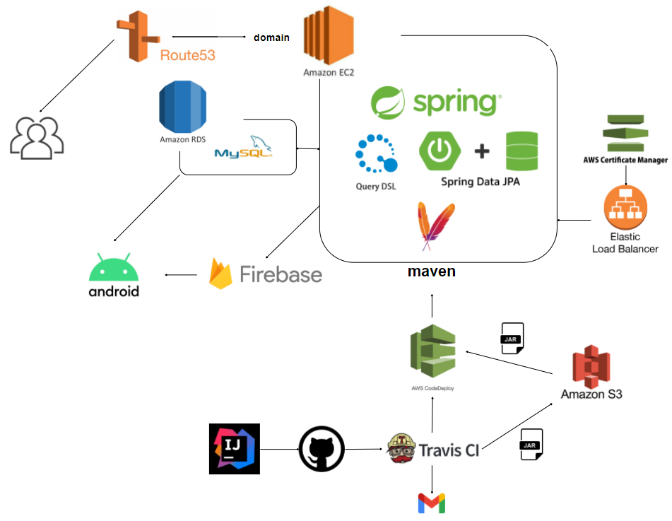
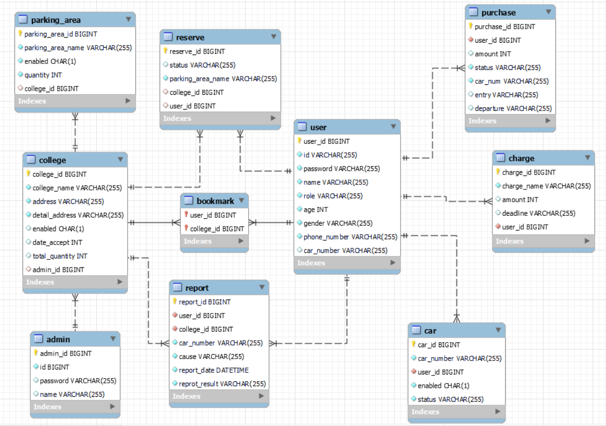

> 본 저장소는 WEB - Repository입니다.

* [WEB - Repository 바로 가기](https://github.com/HongJungWan/HongJungWan-Capstone-Repository)
* [App - Repository 바로 가기](https://github.com/Capstone-Demo/Re-Coder-App-Web/tree/siyeon/basiccode)

<br/><br/>

# ReCoder

### 🚗 대학 주차 관리 플랫폼 [ `Web` / `App` ]

<br/>

> 영상처리 및 문자인식 OCR을 통한 주차 관리 서비스 (Web / App)

<br/><br/>

프로젝트 종료 후, 🛠 리팩토링 중입니다.

---

<br/><br/>

### 👬 팀원 소개

|  |         .....         |         .....          |
|:---------------------------------------------------------------------:|:---------------------:|:----------------------:|
|                                **홍정완**                                |        **김현지**        |        **김시연**         |
|               Web(FE / **BE**) <br/><br/> **AWS Infra**               | Android <br/><br/> DB | Android <br/><br/> OCR |
|                                  팀장                                   |             팀원          |      팀원                  |
|                               "습관이 전부다"                               |           "이슈에 올릴게요"              |          "사회에 선한 영향을 미치고 싶은 개발자"                |

<br/><br/>

### 🗓 프로젝트 일정

* 2022.03 ~ 2022.07

<br/><br/>

## 프로젝트 개요

### 💡 문제 인식

1) 고객은 주차권 발급 서비스 절차에 따라 주관부서에 여러 번 대면 방문을 해야
   되는 불편함을 가진다.
2) 다수의 관리자가 각자 다른 업무를 진행하여 업무 효율성이 높지 않다.
3) 각각의 기관이 독립적으로 관리되고 있기 때문에 큰 비용과 시간이 소요된다.
4) 기관 방문객 감소 시, 주차장 사용 인원 감소된다

<br/>

### ⚔ 개발 목표

* 위의 독립적 주차 서비스의 문제점은 통합 솔루션을 제공해 해결하고자 한다. 이를 본 프
  로젝트의 개발 목표로 삼는다.

<br/><br/>

### ⚙️ 기능

* 정리 중 ...

<br/><br/>

### 📄 정보 구조도

* 정리 중 ...

<br/><br/>

### 🛠 기술 스택



<br/><br/>

### 📎 서버 구조도



<br/><br/>

### DB ERD



<br/><br/>

### 프로젝트 개발환경

```
Web 개발 환경

• IDE : IntelliJ IDEA Ultimate
• 언어 : Java 11
• 프레임워크 : SpringBoot 2.6.x
• 빌드도구 : Apache Maven 3.6.3
• 데이터베이스 : MySQL 8.0.x
```

```
Android 개발 환경

• IDE : Android Studio (Bumblebee 2021.1.1.) 
• 언어 : Java 11
• CR API (Firebase ML v2) 
• CameraX api
• 데이터베이스 : MySQL 8.0.x
```

<br/><br/>

### 🧐 프로젝트 진행 시, 고민했던 점들

* [Travis CI Build, Test Failed 원인 분석 및 해결](https://velog.io/@daydream/Capstone-Travis-CI-Build-Test-Failed-%EC%9B%90%EC%9D%B8-%EB%B6%84%EC%84%9D-%EB%B0%8F-%ED%95%B4%EA%B2%B0)

* [FCM Push 알림 서버를 비동기, 다중 송신으로 개선해 보자](https://velog.io/@daydream/Spring-FCM-Push-%EC%95%8C%EB%A6%BC-%EC%84%9C%EB%B2%84-%EB%B9%84%EB%8F%99%EA%B8%B0-%EC%A0%84%EC%86%A1)

* [EC2 인스턴스에 Swap 공간으로 메모리 할당](https://velog.io/@daydream/EC2-%EC%9D%B8%EC%8A%A4%ED%84%B4%EC%8A%A4%EC%97%90-Swap-%EA%B3%B5%EA%B0%84%EC%9C%BC%EB%A1%9C-%EB%A9%94%EB%AA%A8%EB%A6%AC-%ED%95%A0%EB%8B%B9)

* [[Spring] FCM을 통해 Push 알림 서버 구축하기](https://velog.io/@daydream/Spring-FCM%EC%9D%84-%ED%86%B5%ED%95%B4-Push-%EC%95%8C%EB%A6%BC-%EC%84%9C%EB%B2%84-%EA%B5%AC%EC%B6%95)

* [FCM 알림 구현 중, 비공개 키 파일을 못 찾는 현상](https://velog.io/@daydream/Capstone-java.io.FileNotFoundException-class-path-resource-cannot-be-opened-because-it-does-not-exist)

* [SSL 인증서 적용(https) 후 css 깨짐 현상](https://velog.io/@daydream/Capstone-SSL-%EC%9D%B8%EC%A6%9D%EC%84%9C-%EC%A0%81%EC%9A%A9https-%ED%9B%84-html%EC%97%90%EC%84%9C-css-%EA%B9%A8%EC%A7%90-%ED%98%84%EC%83%81)

* [DB Navigator 연결 오류](https://velog.io/@daydream/AWS-Trouble-shooting-DB-Navigator-%EC%97%B0%EA%B2%B0%EC%98%A4%EB%A5%98)

<br/><br/>

### 커밋 컨벤션

---

✅ 기본적으로 커밋 메시지는 제목 / 본문 / 관련 이슈로 구분 <br/>
✅ feat : 새로운 기능 추가 <br/>
✅ fix : 버그 수정 <br/>
✅ docs : 문서 수정 <br/>
✅ style : 코드 포맷팅, 세미콜론 누락, 코브 변경이 없는 경우 <br/>
✅ refactor : 코드 리펙토링 <br/>
✅ test : 테스트 코드, 리펙토링 테스트 코드 추가 <br/>
✅ chore : 기타 변경사항 <br/>
✅ 제목은 50자를 넘기지 않고, 맞침표를 붙이지 않는다. <br/>
✅ 본문은 "어떻게" 보다 "무엇을" 과 "왜"를 설명한다. <br/>
✅ 제목과 구분되기 위해 한 칸 띄워 작성한다. <br/>

<br/><br/>